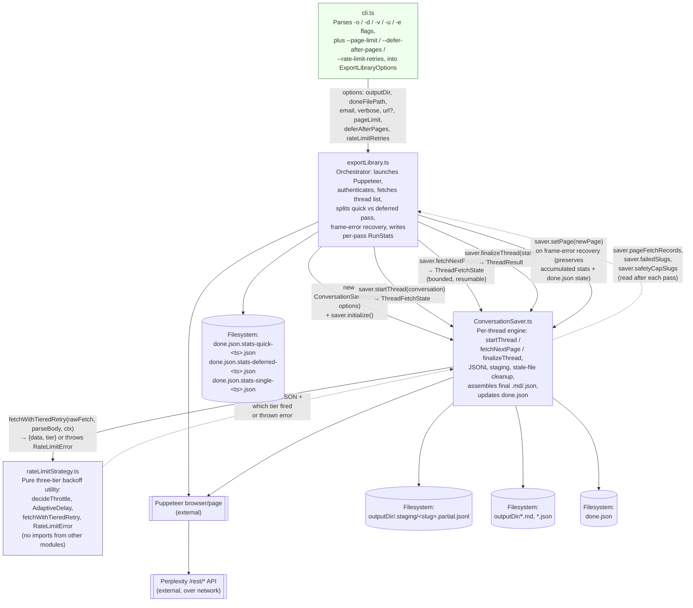

# Module Architecture

Data and call flow between the TypeScript modules in the export pipeline.

## Module responsibilities

| Module | Responsibility | Depends on |
|---|---|---|
| `cli.ts` | Argument parsing only; no business logic. | `exportLibrary.ts` |
| `exportLibrary.ts` | Orchestrates the run: browser lifecycle, thread list (or single `-u/--url` thread), quick/deferred pass split, frame-error recovery, per-pass `RunStats` computation and write. | `ConversationSaver.ts` |
| `ConversationSaver.ts` | Resumable per-thread fetch primitives (`startThread` / `fetchNextPage` / `finalizeThread`), JSONL staging checkpoints, stale-file cleanup, final output write, `done.json` updates, timing/failure/safety-cap tracking. | `rateLimitStrategy.ts` |
| `rateLimitStrategy.ts` | Three-tier backoff decision (`RateLimit-*`/`X-RateLimit-*` header → `Retry-After` → adaptive-AIMD-plus-fixed-schedule fallback), isolated retry loop. | *(none — pure utility)* |

## Key data flows

- **Options** (`outputDir`, `doneFilePath`, `email`, `verbose`, `url`, `pageLimit`, `deferAfterPages`, `rateLimitRetries`) flow one-way from `cli.ts` → `exportLibrary.ts` → `ConversationSaver` constructor. The last three tune the constants the initial design session flagged as "worth revisiting once you see real data," without requiring a rebuild to change them.
- **Conversations** flow from `exportLibrary.ts` (either the full library scan, or a single synthesized `Conversation` in `-u/--url` mode) into `saver.startThread()`. Each thread's `ThreadFetchState` is threaded through repeated `fetchNextPage()` calls, capped at `deferAfterPages` on the first pass; anything not yet `isDone()` is parked in a `deferred` array and resumed to completion in pass 2 — no re-fetching of already-fetched pages.
- **Fetch functions** flow into `fetchWithTieredRetry()`; a resolved page payload plus which tier decided the delay flows back out, or a thrown `RateLimitError` after all retries are exhausted. `rateLimitStrategy.ts` never touches Puppeteer or the filesystem directly, keeping it independently testable and portable to other projects (e.g. LIMIT's shopping/trading automation).
- **Durability**: `fetchNextPage()` appends each page's entries to `<outputDir>/.staging/<slug>.partial.jsonl` (one JSON object per line) *before* returning, in addition to the in-memory `ThreadFetchState.entries`. `startThread()` checks for a matching staging file and resumes from its last complete line (a truncated trailing line from a mid-write crash is safely discarded) instead of starting a thread over from page 0. The staging file is deleted only after the permanent `.json`/`.md` pair and `done.json` are safely written.
- **Recovery**: on a detached-Frame / Target-closed / Session-closed / protocolTimeout error, `exportLibrary.ts` recreates the Puppeteer page and calls `saver.setPage(newPage)` — it does **not** construct a new `ConversationSaver` — so accumulated `pageFetchRecords`, `failedSlugs`, `safetyCapSlugs`, and the in-memory `done.json` state all survive the recovery.

## Filename standards

- PascalCase for files exporting a single class, camelCase for function/utility modules.
