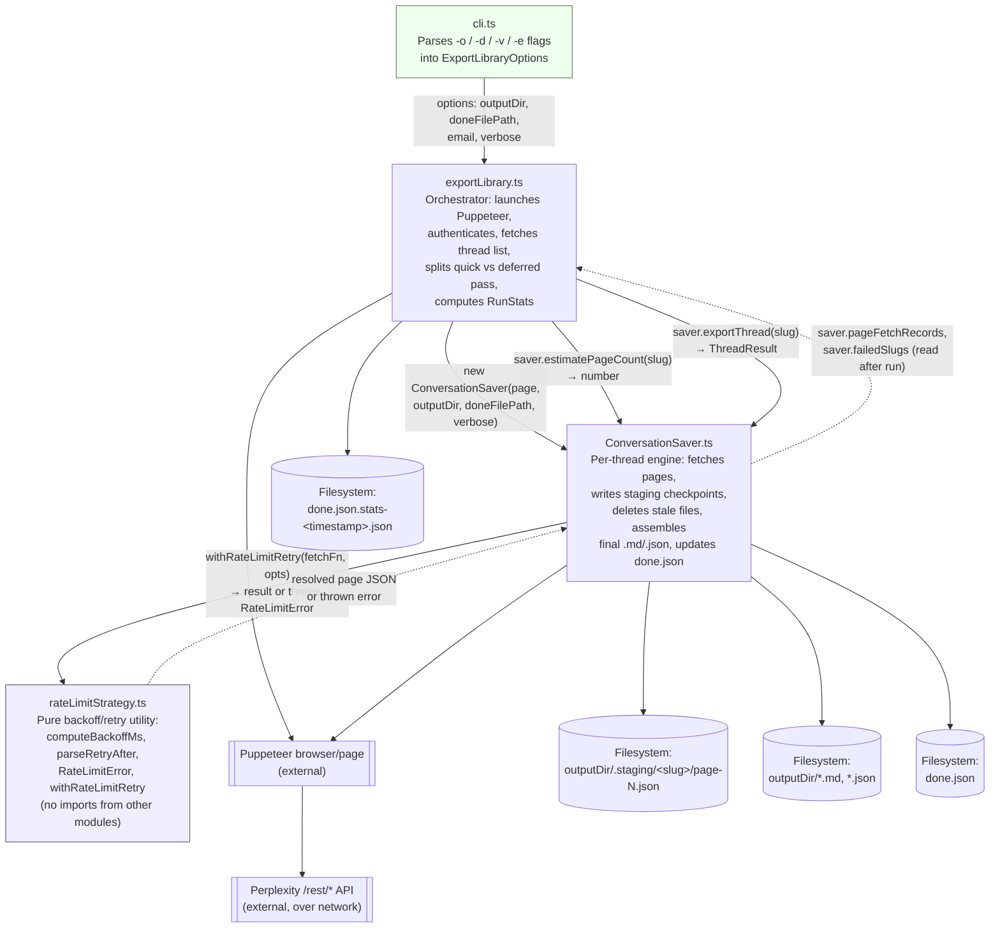

## Module Architecture

Data and call flow between the TypeScript modules in the export pipeline.

### Module responsibilities

| Module | Responsibility | Depends on |
|---|---|---|
| `cli.ts` | Argument parsing only; no business logic. | `exportLibrary.ts` |
| `exportLibrary.ts` | Orchestrates the run: browser lifecycle, thread list, pass 1/pass 2 split, final `RunStats` computation and write. | `ConversationSaver.ts` |
| `ConversationSaver.ts` | Per-thread fetch loop, staging checkpoints, stale-file cleanup, final output write, `done.json` updates, timing/failure tracking. | `rateLimitStrategy.ts` |
| `rateLimitStrategy.ts` | Backoff schedule (30/60/120/240/300/300/300s), `Retry-After` header parsing, isolated retry loop. | *(none — pure utility)* |

### Key data flows

- **Options** (`outputDir`, `doneFilePath`, `email`, `verbose`) flow one-way from `cli.ts` → `exportLibrary.ts` → `ConversationSaver` constructor.
- **Slugs** flow from `exportLibrary.ts` into `saver.exportThread()`; a `ThreadResult` and accumulated `pageFetchRecords`/`failedSlugs` flow back out for the end-of-run stats file.
- **Fetch functions** flow into `withRateLimitRetry()`; a resolved page payload or a thrown `RateLimitError` flows back out. `rateLimitStrategy.ts` never touches Puppeteer or the filesystem directly, keeping it independently testable.

### Filename standards

- PascalCase for files exporting a single class, camelCase for function/utility modules.
