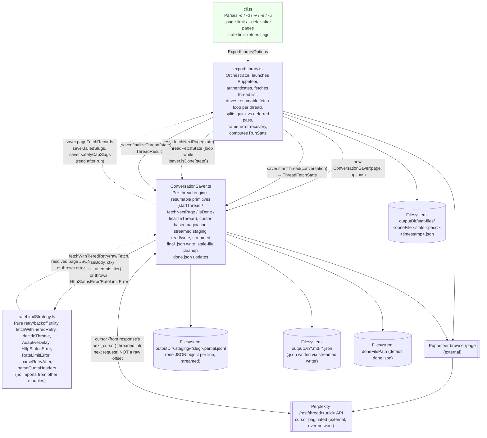

## Module Architecture

Data and call flow between the TypeScript modules in the export pipeline.

### Module responsibilities

| Module | Responsibility | Depends on |
|---|---|---|
| `cli.ts` | Argument parsing only; no business logic. | `exportLibrary.ts` |
| `exportLibrary.ts` | Orchestrates the run: browser lifecycle, thread list, drives the resumable per-thread fetch loop, pass 1 (quick) / pass 2 (deferred) split, frame-error recovery via page recreation, failure logging with resume hints, final `RunStats` computation and write. | `ConversationSaver.ts` |
| `ConversationSaver.ts` | Per-thread resumable fetch primitives (`startThread`/`fetchNextPage`/`isDone`/`finalizeThread`), cursor-based pagination against the real API mechanism, streamed staging-file read/write, streamed final `.json` write, stale-file cleanup (after new files are confirmed written), `done.json` updates, timing/failure tracking. | `rateLimitStrategy.ts` |
| `rateLimitStrategy.ts` | Three-tier backoff (quota headers → `Retry-After` → adaptive/fixed schedule), retries 429/502/503/504 and raw fetch-level exceptions, throws `HttpStatusError` (with status code) for non-retryable statuses. | *(none — pure utility)* |

### Key data flows

- **Options** (`outputDir`, `doneFilePath`, `email`, `verbose`, `pageLimit`, `deferAfterPages`, `rateLimitRetries`, `url`) flow one-way from `cli.ts` → `exportLibrary.ts` → `ConversationSaver` constructor.
- **Per-thread state** (`ThreadFetchState`) is created by `startThread()` — reconstructed from any existing staging file rather than starting fresh — and threaded through repeated `fetchNextPage()` calls until `isDone()`, then handed to `finalizeThread()`. This split is what lets `exportLibrary.ts` pause a still-fetching thread after `--defer-after-pages` pages (parking its live state for pass 2) without losing progress or re-fetching.
- **Pagination** is cursor-based, not offset-based: each response's `next_cursor` field is threaded into the next request's `cursor` query parameter. A raw numeric `offset` is not what actually advances the server's window — confirmed by diffing this tool's request against the real Perplexity frontend's own network traffic.
- **Fetch functions** flow into `fetchWithTieredRetry()`; a resolved page payload, tier used, and retry count flow back out, or an `HttpStatusError`/`RateLimitError` is thrown. `rateLimitStrategy.ts` never touches Puppeteer or the filesystem directly, keeping it independently testable.
- **Durability**: every successfully-fetched page is appended to the JSONL staging file immediately (streamed, not buffered in one string), independent of any specific failure mode — this is what makes a crash from a network error, a V8 string-length limit, or anything else equally recoverable via a plain rerun of the same command.
